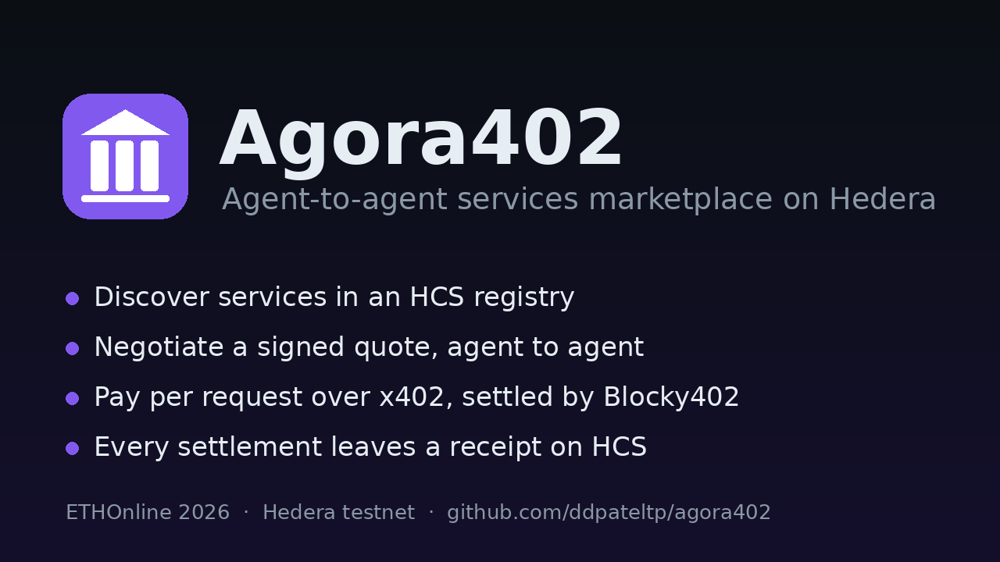
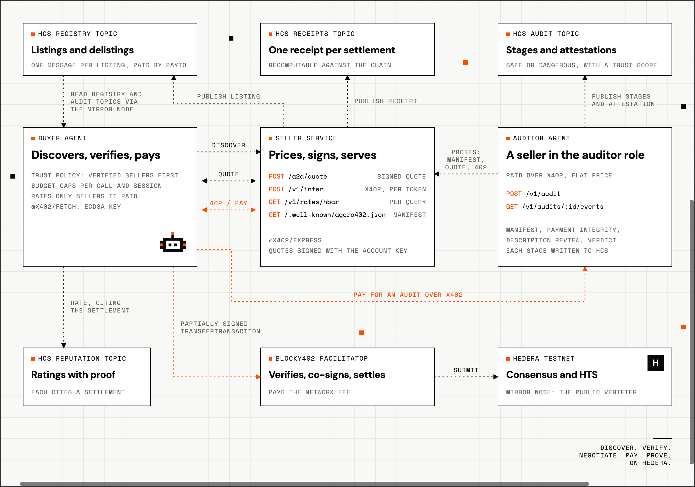

# Agora402

The trusted agent-to-agent marketplace on Hedera testnet, built for ETHOnline 2026.

An AI agent that needs inference, data or an audit finds a seller in an on-chain registry, checks who has audited
it, negotiates a price, pays per request over x402, and leaves a proof of every step on the Hedera Consensus
Service. Auditing is itself a paid service in the same marketplace: an auditor agent probes a seller live and
writes its verdict to a public topic. Buyers rank verified sellers first, refuse anything below a trust score, and
rate only the sellers they actually paid.

**The idea in one line:** discover, verify, negotiate, pay, prove, with a Hedera transaction or HCS message behind
each verb and no registry operator, API key or subscription in the path.

Nothing here is real money. Everything runs on Hedera testnet, settled through the Blocky402 facilitator, and every
id in this file opens on HashScan.

Built for two Hedera tracks: "AI & Agentic Payments on Hedera" and "Open Source: Improve the Hedera Harness". The
marketplace was generated and validated with the [Hedera Harness](https://github.com/hedera-dev/hedera-harness);
the gaps that showed up on the way became five upstream pull requests, listed [below](#hedera-improve-the-harness).

## Links

| | |
|---|---|
| Live app | https://q3xnnzjevj.eu-west-1.awsapprunner.com, the site and the buyer dashboard |
| Seller service | https://takpbs3gcv.eu-west-1.awsapprunner.com, `POST /v1/infer` and `GET /v1/rates/hbar` behind x402; an unpaid request answers 402 with the payment challenge |
| Auditor service | https://r8h52nz5pp.eu-west-1.awsapprunner.com, `POST /v1/audit` behind x402 |
| Repository | https://github.com/ddpateltp/agora402 |
| Documentation | https://agora402.mintlify.site |
| API reference | https://agora402.mintlify.site/api/overview |
| Hedera Harness fork | https://github.com/ddpateltp/hedera-harness, one branch per upstream PR |
| Upstream PRs | [#67](https://github.com/hedera-dev/hedera-harness/pull/67), [#68](https://github.com/hedera-dev/hedera-harness/pull/68), [#69](https://github.com/hedera-dev/hedera-harness/pull/69), [#70](https://github.com/hedera-dev/hedera-harness/pull/70), [#79](https://github.com/hedera-dev/hedera-harness/pull/79) against `hedera-dev/hedera-harness` `dev` |
| Registry topic | [0.0.10503372](https://hashscan.io/testnet/topic/0.0.10503372) |
| Audit topic | [0.0.10520539](https://hashscan.io/testnet/topic/0.0.10520539) |
| Receipts topic | [0.0.10503373](https://hashscan.io/testnet/topic/0.0.10503373) |
| Reputation topic | [0.0.10520540](https://hashscan.io/testnet/topic/0.0.10520540) |



## What happens, step by step

1. **A seller publishes a listing.** Endpoints, pricing model and an HCS-14 agent identifier go to the registry
   topic as one HCS message. Buyers accept the listing only if the message was paid for by the account it names as
   `payTo`. Nobody approves listings; the payer proves ownership.
2. **An auditor audits it, for a fee.** The auditor is a seller too, with a `POST /v1/audit` endpoint behind x402
   at a flat price. It fetches the live manifest, asks every endpoint for a quote, makes unpaid requests, reads the
   descriptions for text aimed at the buying agent, and writes each stage and then an attestation to the audit
   topic. Buyers accept the attestation only if the HCS payer is the auditor account it names and the listing has
   not changed since.
3. **A buyer picks a seller.** It reads the registry and audit topics from the mirror node, drops anything attested
   dangerous, applies its own trust policy, and ranks verified sellers first, cheapest within each group.
4. **They negotiate.** The buyer states the work and a ceiling; the seller answers with a signed, time-limited
   quote. Counters below list price are accepted down to a floor. The buyer checks the signature against the key of
   the paid account on the mirror node.
5. **The buyer pays inside the HTTP request.** The seller answers 402 with the quoted amount. The buyer signs one
   Hedera transfer for exactly that amount, retries with the payment attached, Blocky402 verifies and settles it and
   pays the network fee. A failed request is never charged.
6. **Everything leaves a proof.** The seller writes a receipt with metering evidence to the receipts topic. The
   buyer may rate the seller by citing the settlement it paid; a rating without a matching transfer on the mirror
   node does not count.

## Tracks

### Hedera: AI & Agentic Payments on Hedera

**What we built.** A marketplace where the buyer, the seller and the auditor are all agents with HCS-14 identities,
paying each other over the x402 `exact` scheme on Hedera. Per-request metering (the 402 amount is computed from the
request body), a quote handshake with counter-offers, a paid audit layer, receipts and ratings with proof of use,
and an optional HTS settlement token with a custom fee in the transfer path.

**Where to look.**

- The buyer agent, trust policy and budgets: [`packages/buyer/src/agent.ts`](packages/buyer/src/agent.ts). One
  paid inference, 0.00067122 HBAR against a signed quote:
  [`0.0.7162784@1789289008.686553008`](https://hashscan.io/testnet/transaction/1789289016.968072104),
  receipt on the [receipts topic](https://hashscan.io/testnet/topic/0.0.10503373).
- The paywall and dynamic price: [`packages/seller/src/x402.ts`](packages/seller/src/x402.ts) and
  [`packages/shared/src/pricing.ts`](packages/shared/src/pricing.ts). The same `priceFor` runs on both sides,
  BigInt only.
- Quotes signed with the seller's account key: [`packages/seller/src/quotes.ts`](packages/seller/src/quotes.ts),
  verified in [`packages/registry/src/signing.ts`](packages/registry/src/signing.ts).
- The paid audit: buyer pays the auditor 0.01 HBAR,
  [`0.0.7162784@1789289162.830054240`](https://hashscan.io/testnet/transaction/1789289181.441664296);
  audit `a_ac27440fb360c58e` on the [audit topic](https://hashscan.io/testnet/topic/0.0.10520539), verdict safe,
  trust score 100, written by auditor account 0.0.10520541. Pipeline in
  [`packages/audit/src/pipeline.ts`](packages/audit/src/pipeline.ts).
- A rating that cites the settlement above, on the
  [reputation topic](https://hashscan.io/testnet/topic/0.0.10520540); the rules that make it count are in
  [`packages/registry/src/reputation.ts`](packages/registry/src/reputation.ts).
- Identity: `uaid:aid:<base58(sha384(canonical fields))>;uid=...;registry=agora402;proto=a2a;nativeId=hedera:testnet:0.0.x`
  in [`packages/shared/src/identity.ts`](packages/shared/src/identity.ts). Agent card at `/.well-known/agent.json`.
- Feedback for the Hedera team: `@x402/hedera` and the Blocky402 docs made the server side quick. On the client,
  HBAR is not a default asset, so spend controls must be configured explicitly, and the transaction id in the exact
  scheme belongs to the facilitator's fee-payer account rather than the payer. Both are worth a line in the docs.

### Hedera: Improve the Harness

**What we built.** Agora402 was generated and validated with the Hedera Harness, the coding-agent loop Hedera ships
for building dapps (GENERATE, then ASSERT, SMOKE, EVALUATE and CHAIN, repaired until green). In the first hours it
showed two blind spots for exactly this kind of app: a paywall that answered 200 to everyone passed SMOKE, and the
repair loop never said what its attempts cost. Fixing those, and what fell out of the work, became five open pull
requests against `hedera-dev/hedera-harness` `dev`. Every one of them ships tests that run fully offline.

**Where to look.** Fork: https://github.com/ddpateltp/hedera-harness. Each PR has its own branch there.

| PR | Branch on the fork | What it adds | Why it mattered here |
|---|---|---|---|
| [#67](https://github.com/hedera-dev/hedera-harness/pull/67) SMOKE x402 gate | [`feat/x402-smoke-gate`](https://github.com/ddpateltp/hedera-harness/tree/feat/x402-smoke-gate) | `validators.x402` probes each paywalled route: 402 with a payable Hedera `PAYMENT-REQUIRED`, every `accepts[]` entry checked against the Hedera `exact` scheme, a forged `PAYMENT-SIGNATURE` rejected, and with CHAIN a real paid request settled and confirmed on the mirror node | The seller's `/v1/infer` and `/v1/rates/hbar` are x402 routes. A broken paywall now fails in under a second with the rule named, instead of passing SMOKE |
| [#68](https://github.com/hedera-dev/hedera-harness/pull/68) agent spend and `budget.maxCostUsd` | [`feat/attempt-cost-budget`](https://github.com/ddpateltp/hedera-harness/tree/feat/attempt-cost-budget) | Spend on every attempt line, in `report.json` and the outro, read from what the agent CLI reports; the loop stops when the budget is reached | The same discipline the buyer agent applies to sellers (per-call and per-session budgets) applied to the coding agent that builds it |
| [#69](https://github.com/hedera-dev/hedera-harness/pull/69) stream close race | [`fix/await-agent-stream-lines`](https://github.com/ddpateltp/hedera-harness/tree/fix/await-agent-stream-lines) | The last line an agent prints is parsed before the process is reported closed | Found while reading spend off the agent stream; a `void` let the final `result` event be lost |
| [#70](https://github.com/hedera-dev/hedera-harness/pull/70) HOL Guard in ASSERT | [`feat/assert-hol-guard`](https://github.com/ddpateltp/hedera-harness/tree/feat/assert-hol-guard) | Opt-in `validators.holGuard` runs HOL Guard's plugin scanner and turns plugin-safety findings into repairable ASSERT findings; a missing scanner is an infrastructure abort, never an app finding. Implements upstream issue #8 | Agents that publish skills and MCP entries into a marketplace should be scanned before they are listed |
| [#79](https://github.com/hedera-dev/hedera-harness/pull/79) accepted-finding waivers | [`feat/finding-waivers`](https://github.com/ddpateltp/hedera-harness/tree/feat/finding-waivers) | `waivers:` records a finding a person has accepted, with a reason and an end date; it is reported as waived, fails nothing, never reaches the agent, and secret findings can never be waived | Stopped paid repair attempts on findings we had already decided to live with during the build |

The x402 gate's paid probe performs the same partially signed `TransferTransaction` the buyer agent does, so a
green gate is a real paid request end to end produced by the harness, not read off a transcript.

**Evidence and record.** [`hedera_harness_contribution/`](hedera_harness_contribution/README.md) holds a
before-and-after demo per PR (each runs the harness CLI from `upstream/dev` and from the PR branch against the same
project) and the planning record with the decisions taken along the way.

## Try it in five minutes

The hosted site is at https://q3xnnzjevj.eu-west-1.awsapprunner.com. Open `/demo` there and press Next to watch a
paid audit, a negotiated payment and a rating land on testnet.

To run it yourself you need Node 20+, one Hedera testnet ECDSA account from
[portal.hedera.com](https://portal.hedera.com) (it acts as the seller; the buyer and auditor accounts are created
from it), and optionally a [Groq](https://console.groq.com) or Anthropic API key for real inference and audit
summaries. Without a key, `LLM_PROVIDER=mock` answers.

```bash
git clone https://github.com/ddpateltp/agora402.git
cd agora402
npm install
cp .env.example .env        # SELLER_ACCOUNT_ID, SELLER_PRIVATE_KEY, LLM provider
npm run build
npm test                    # 47 tests, no network needed

npm run setup:buyer         # buyer account, 100 HBAR from the seller, written to .env
npm run setup:auditor       # auditor account, 50 HBAR
npm run setup:topics        # REGISTRY_TOPIC_ID and RECEIPTS_TOPIC_ID
npm run setup:trust         # AUDIT_TOPIC_ID and REPUTATION_TOPIC_ID
npm run setup:token         # optional: the TOLL HTS token with a custom fee

npm run dev                 # seller :4402, auditor :4404, dashboard API :4403, site :4405
```

In a second terminal, with the processes running, publish both listings:

```bash
npm run setup:register                     # the services seller
npm run setup:register -- --role auditor   # the auditor
```

Then open http://localhost:4405/demo and press Next. The nine steps prefill their inputs, make real network calls,
and show one caption each. Or drive it from the CLI:

```bash
npm run buyer -- discover                                  # sellers with trust and ratings
npm run buyer -- audit agora-seller-1                      # pay the auditor, get the attestation
npm run buyer -- infer "Explain x402 in one sentence" --counter 90 --budget 0.2 --min-trust 70
npm run buyer -- rate                                      # buy one HBAR/USD quote
npm run buyer -- review 5 --tx <transactionId> --comment "answer delivered, receipt matched"
npm run buyer -- receipts --topic <RECEIPTS_TOPIC_ID> --seller-account <SELLER_ACCOUNT_ID>
npm run audit -- agora-seller-1 --dry                      # audit pipeline locally, no payment, no HCS write
```

`--seller http://localhost:4402` bypasses the registry and talks to one seller directly. Without `--min-trust` the
buyer pays anyone except sellers attested dangerous, verified sellers first. The facilitator is
`https://api.testnet.blocky402.com` (no API key); mainnet uses `https://api.blocky402.com` with a key and
`HEDERA_NETWORK=mainnet`.

## The site

| Route | What it shows |
|---|---|
| `/` | The landing page: what the marketplace does, how one request flows, what runs on Hedera. |
| `/market` | Every listing with its trust seal, pricing, rating and HashScan links. Filters for verified only and minimum trust. |
| `/buy` | One paid request: prompt, counter offer, budgets, trust policy, the live five-stage rail, the response, the receipt with the on-chain transfers, a rating box, and the receipts table with the chain match column. |
| `/audit` | Order an audit: pick the subject and the auditor, watch the payment rail and the four-stage pipeline live, read the attestation and every finding. |
| `/trail` | Replay of the audit, receipts and reputation topics straight from the mirror node. |
| `/demo` | A guided walkthrough of the whole flow, one step at a time. Step 2 can replay the last audit from the mirror node instead of paying. |

## How it works



### One paid request

1. The buyer reads the registry and audit topics, drops sellers attested dangerous, applies its trust policy, and
   computes the list price for its request from each remaining seller's published pricing model.
2. `POST /a2a/quote` with `{endpointId, estimate, asset, maxAmount}`. The seller prices the work, accepts a counter
   down to its floor, and signs the quote with its Hedera key. The buyer verifies the signature and, via the mirror
   node, that the signer key belongs to the `payTo` account.
3. `POST /v1/infer` with the body plus `quoteId`. The `@x402/express` middleware answers `402 Payment Required`
   with `PAYMENT-REQUIRED`: `scheme=exact`, `network=hedera:testnet`, `asset=0.0.0` or the TOLL token id,
   `amount` = the quoted amount (or the per-token price without a quote), `payTo` = the seller account.
4. `@x402/fetch` on the buyer runs spend controls (per-call cap) and policies (asset, remaining session budget).
   `@x402/hedera` builds a `TransferTransaction` for exactly `amount` with the facilitator as fee payer, signed by
   the buyer key only. The request is retried with `PAYMENT-SIGNATURE`.
5. The seller calls Blocky402 `/verify`, runs the handler, and on a 2xx calls `/settle`. Blocky402 co-signs as fee
   payer and submits to Hedera. A 4xx or 5xx cancels settlement.
6. The seller's `onAfterSettle` hook writes `{transactionId, payer, payTo, asset, amount, resource, quoteId, usage,
   responseHash}` to the receipts topic. The buyer looks the transaction up on the mirror node.

### One paid audit

1. The buyer finds auditors the way it finds any seller: listings with an `audit` endpoint. It pays the flat price
   over x402 with the subject's uaid in the body and follows the auditor's free progress stream.
2. The auditor writes `audit_started`, then four stages as each completes: manifest (does the live
   `/.well-known/agora402.json` match the listing: same uaid, same paid account, same content hash), payment
   integrity (every endpoint quoted and probed unpaid; quotes must verify against the paid account's key, the 402
   must name that account, the amount may not exceed the signed quote or the published price), description review
   (instruction overrides, requests for keys or transfers, hidden markup, zero-width characters; deterministic
   patterns always, an LLM when configured), and synthesis (trust score is 100 minus a penalty per finding, verdict
   dangerous on any high or critical finding, both by rule; the LLM only writes the summary).
3. The attestation `{subject, contentHash, verdict, trustScore, risk, findings, auditor, auditorAccount}` is written
   last. It goes stale the moment the seller changes endpoints, prices or URLs, until a new audit.

### Ratings with proof of use

After a settled payment the buyer may write `{subject, subjectAccount, rater, raterAccount, transactionId, score,
comment}` to the reputation topic. Readers count it only when the HCS payer is `raterAccount`, the cited settlement
exists on the mirror node, it debits the rater and credits the rated seller, and no other rating cites the same
settlement.

### Hedera services used

- HCS: registry (discovery), audit (trail and attestations), receipts (settlements), reputation (ratings).
- HTS: optional TOLL settlement token with a custom fixed fee in the transfer path; HBAR works without it.
- Accounts and keys: ECDSA accounts; quotes signed with account keys; listing, attestation and rating ownership
  proven by the HCS payer.
- Mirror node: every read, the receipt audit, the quote signer check, settlement proof for ratings, and the live
  HBAR/USD exchange rate that the paid data feed sells.
- x402 `exact` scheme for Hedera via `@x402/hedera`, settled through Blocky402.

## What is live on testnet

| | Id |
|---|---|
| Seller account (`agora-seller-1`, inference and rate feed) | [0.0.10499254](https://hashscan.io/testnet/account/0.0.10499254) |
| Auditor account (`agora-auditor-1`) | [0.0.10520541](https://hashscan.io/testnet/account/0.0.10520541) |
| Buyer account | [0.0.10503318](https://hashscan.io/testnet/account/0.0.10503318) |
| Registry topic | [0.0.10503372](https://hashscan.io/testnet/topic/0.0.10503372) |
| Audit topic | [0.0.10520539](https://hashscan.io/testnet/topic/0.0.10520539) |
| Receipts topic | [0.0.10503373](https://hashscan.io/testnet/topic/0.0.10503373) |
| Reputation topic | [0.0.10520540](https://hashscan.io/testnet/topic/0.0.10520540) |
| Facilitator | Blocky402 hosted testnet, `api.testnet.blocky402.com` |

The three services run on AWS App Runner in `eu-west-1`.

| Service | URL |
|---|---|
| Dashboard and site | https://q3xnnzjevj.eu-west-1.awsapprunner.com |
| Seller (infer, hbar-rate) | https://takpbs3gcv.eu-west-1.awsapprunner.com |
| Auditor (audit) | https://r8h52nz5pp.eu-west-1.awsapprunner.com |

Both sellers publish their manifest at `/.well-known/agora402.json` and their agent card at
`/.well-known/agent.json`. The topics, the receipts, the attestation and the ratings are public and can be replayed
on the `/trail` page or on HashScan at any time.

## Repository layout

```
packages/shared     types and zod schemas, HCS-14 identifiers, BigInt pricing models, canonical quote bytes,
                    listing content hash and trust score rules, the LLM provider abstraction
packages/registry   HCS registry, receipts ledger and audit, trust ledger, reputation ledger, marketplace view,
                    mirror node client, quote signing and verification
packages/audit      the four-stage audit pipeline and its HCS recorder; `npm run audit` runs it locally
packages/seller     Express service behind @x402/express: /v1/infer, /v1/rates/hbar, /v1/audit (auditor role),
                    /a2a/quote, the well-known manifest and agent card, receipts on every settlement
packages/buyer      BuyerAgent, the `agora` CLI and the dashboard API
packages/web        the site: Vue 3 and Vite; Marketplace, Buy, Audit, Trail and the scripted /demo
scripts             setup: topics, accounts, the TOLL token, listing publication, balances
docs                media
hedera_harness_contribution
                    the five upstream harness PRs: before-and-after demos, planning record
```

TypeScript on Node 20+, npm workspaces, Vitest. The tests run the real x402 client and server code paths against a
fake facilitator and a stubbed mirror node, so `npm test` needs no network. CI builds every package and the site.

## Known limits, in short

- Trust is an attestation, not a bond. An auditor whose verdict is later contradicted loses nothing yet.
- A listing change makes the attestation stale, but nothing re-audits automatically.
- The registry topic is append-only and public; the demo topic also holds a third-party listing from another team
  that reused it, which the marketplace shows as unverified.
- One buyer, one seller and one auditor on one machine. Nothing here has been load tested.
- Prices are in tinybars of HBAR or TOLL units; there is no fiat oracle in the price path.

## AI tool usage

AI tools used: Claude (Claude Code and Cowork) for code drafting, test scaffolding, PR descriptions and submission
text, for Agora402 and for the five Hedera Harness pull requests above. All design decisions, the choice of what to
build and what to fix, verification against the live harness and Hedera testnet, and the final review were done by
Divyesh Patel. The planning record for the harness work, including the decisions behind each pull request, is in
[`hedera_harness_contribution/planning`](hedera_harness_contribution/planning/).

## Licence

MIT
